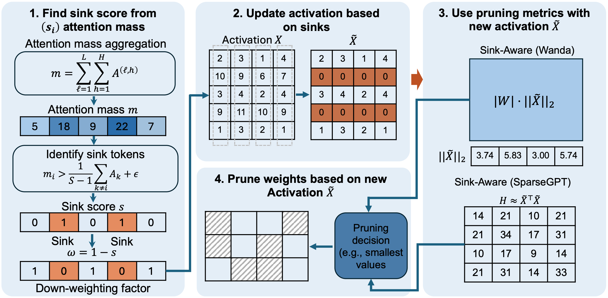

# Sink-Aware Pruning for Diffusion Language Models

<p align="center">
  <a href="https://arxiv.org/abs/XXXX.XXXXX"></a>
  &nbsp;
  <a href="#"></a>
  &nbsp;
  <a href="#"></a>
</p>

<br>

> **TL;DR:** Attention sinks in Diffusion Language Models are *transient*, not stable anchors — so the AR heuristic of "always keep sinks" breaks. We identify and prune them instead, beating strong pruning baselines at matched compute.

<br>

---

## 📖 Overview

**Diffusion Language Models (DLMs)** generate text through iterative denoising over multiple timesteps — a fundamentally different paradigm from autoregressive (AR) models. Yet existing pruning methods blindly inherit AR assumptions, including the popular heuristic of *preserving attention sink tokens*.

We show this assumption **does not transfer** to DLMs:

| Property | AR LLMs | Diffusion LLMs |
|---|---|---|
| Sink spatial concentration | ✅ High | ❌ Low (distributed) |
| Sink temporal stability | ✅ Near-zero variance | ❌ High variance |
| Sink positions across steps | 🔒 Fixed (prefix tokens) | 🌊 Shift progressively as denoising advances |
| "Always keep sinks" heuristic | ✅ Beneficial | ❌ **Suboptimal** |

**Sink-Aware Pruning** is a diffusion-native pruning strategy that:
1. 📊 **Measures sink variance** over the full denoising trajectory
2. 🎯 **Identifies unstable sinks** whose positions shift significantly across timesteps
3. ✂️ **Prunes them** — reducing redundant global attention without hurting quality

### Pipeline

<p align="center">
  
</p>
<p align="center"><b>Figure:</b> Overview of the Sink-Aware Pruning pipeline. <b>(1)</b> Compute attention mass to identify sink tokens and derive per-token down-weighting factors. <b>(2)</b> Update activations by zeroing out sink-token rows. <b>(3)</b> Apply standard pruning metrics (Wanda or SparseGPT) using the modified activations. <b>(4)</b> Make final pruning decisions based on the updated importance scores.</p>

---

## 🔑 Key Findings

### Sink positions are unstable in DLMs

<div align="center">

```
AR LLMs:   sink position ─────────────────────────── (stable)
DLMs:      sink position ╱╲  ╱╲╱ ╲╱╲   ╱╲╱  ╲╱╲   (drifts!)
                         early denoising → late denoising
```

</div>

Sinks in DLMs are ephemeral — they matter at certain timesteps (high-noise global structure formation) and fade later. Preserving them wastes the sparsity budget on positions that won't persist.

### Pruning transient sinks improves compressed model quality

Sink-Aware Pruning consistently **matches or outperforms** Wanda and SparseGPT baselines across 8 benchmarks, with gains growing under aggressive compression

> Gains are most pronounced at **higher sparsity**, where avoiding mispriced sink weights has the highest impact on model utility.

---

## 📊 Results

### Unstructured Pruning — LLaDA 8B

| Sparsity | Method | Avg | MMLU | ARC-C | PIQA | WinoG | GSM8K | HellaSwag |
|:---:|:---:|:---:|:---:|:---:|:---:|:---:|:---:|:---:|
| — | Dense | 57.93 | 65.97 | 43.00 | 74.10 | 69.30 | 69.29 | 72.70 |
| 50% | Wanda | 52.70 | 61.43 | 39.08 | 72.63 | 64.56 | 57.01 | 67.52 |
| 50% | **Sink-Aware** | **53.18** | **62.16** | **41.38** | **73.18** | **65.27** | 55.88 | 67.18 |
| 50% | SparseGPT | 52.34 | 60.97 | 39.68 | 72.20 | 64.64 | 53.53 | 66.90 |
| 50% | **Sink-Aware** | **52.36** | 60.79 | 39.59 | **72.95** | **65.82** | 52.11 | **67.35** |

### Structured Pruning — LLaDA 8B

| Pruning Ratio | Method | PIQA | WinoG | ARC-E | ARC-C |
|:---:|:---:|:---:|:---:|:---:|:---:|
| 0.3 | Baseline | 0.6834 | 0.6630 | 0.6907 | 0.3780 |
| 0.3 | **Sink-Aware** | **0.6955** | **0.6740** | **0.7175** | **0.3820** |
| 0.5 | Baseline | 0.5898 | 0.5572 | 0.4853 | 0.2039 |
| 0.5 | **Sink-Aware** | **0.6037** | **0.5724** | **0.5279** | **0.2362** |

Full results for Dream 7B, LLaDA-1.5, and MMaDA are available in the paper.

---

## 🚀 Getting Started

> **⚠️ Code coming soon!** Star ⭐ the repo to get notified.


## 📝 Citation

If you find this work useful, please consider citing:

```bibtex
@article{myrzakhan2025sinkawarepruning,
  title     = {Sink-Aware Pruning for Diffusion Language Models},
  author    = {Myrzakhan, Aidar and Li, Tianyi and Guo, Bowei and Tang, Shengkun and Shen, Zhiqiang},
  journal   = {arXiv preprint arXiv:XXXX.XXXXX},
  year      = {2025}
}
```
